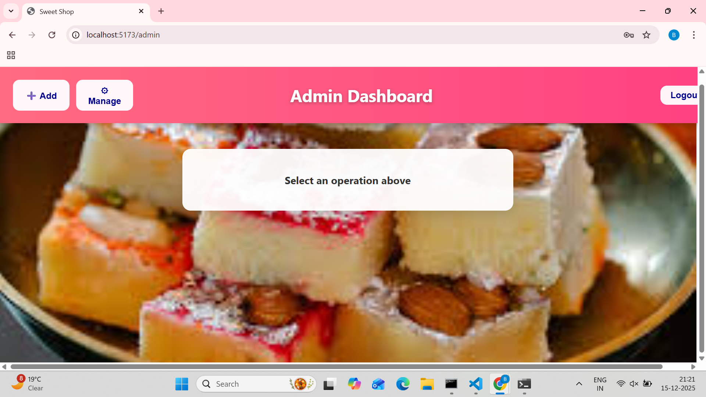
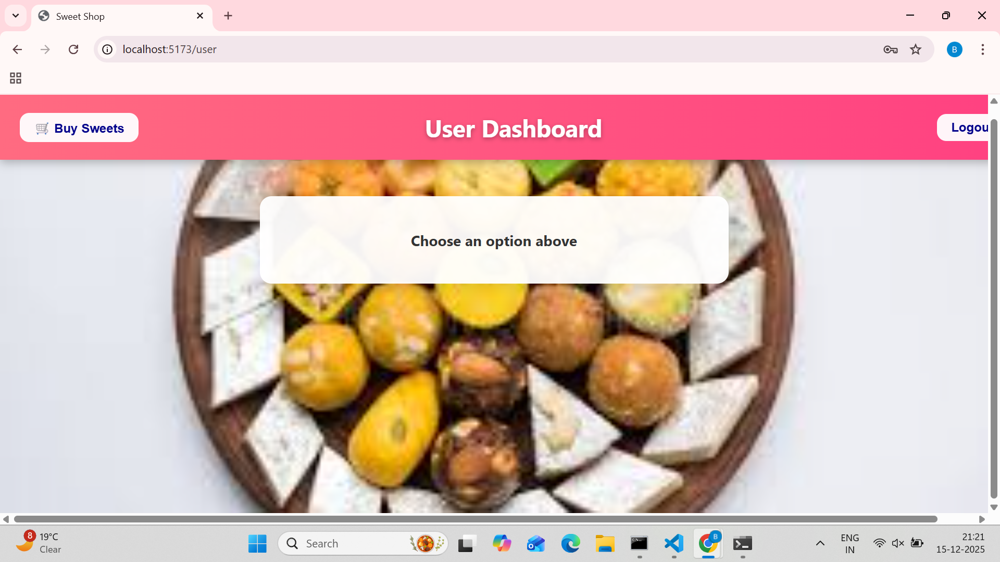
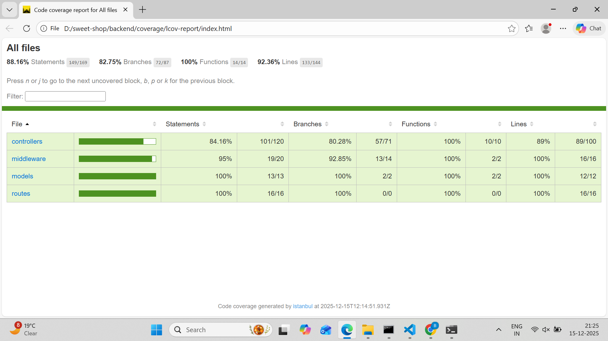

````markdown
# 🍭 Sweet Shop Management System 🍬

✨ A full-stack **Sweet Shop Management System** built with **React**, **Node.js**, **Express**, and **MongoDB** — designed using **Test-Driven Development (TDD)** principles and modern UI practices.

---

## 🌟 What is this Project?

The **Sweet Shop Management System** helps manage sweets inventory and user purchases with **role-based access**:

🧑‍💻 **Users** can browse and purchase sweets  
🧑‍🔧 **Admins** can manage inventory (add, update, restock, delete)

---

## 🎯 Key Highlights

✅ JWT-based Authentication  
✅ Role-based Authorization (Admin / User)  
✅ Real-time Inventory Updates  
✅ Purchase Button Disabled When Out of Stock  
✅ Clean UI with Cards & Grids  
✅ Built using TDD methodology  

---

## 🧁 Features Breakdown

### 🔐 Authentication
- Register new users
- Login with secure JWT tokens

### 🍩 Sweet Management (Admin)
- Add new sweets
- Update sweet details
- Delete sweets
- Restock inventory

### 🛒 User Experience
- View all sweets
- Search sweets
- Purchase sweets
- Out-of-stock handling

---

## 🛠️ Tech Stack

| Layer | Tech |
|-----|-----|
| 🎨 Frontend | React, React Router |
| ⚙️ Backend | Node.js, Express |
| 🗄️ Database | MongoDB |
| 🔑 Auth | JWT |
| 🎨 Styling | CSS (Flexbox & Grid) |

---

## 🗂️ Project Structure

```bash
Sweet-Shop-Management-System/
│
├── backend/
│   ├── controllers/
│   ├── models/
│   ├── routes/
│   ├── tests/
│   └── server.js
│
├── frontend/
│   ├── public/
│   ├── src/
│   └── package.json
│
├── .gitignore
└── README.md
````

---

## 🚀 Getting Started

### 🖥️ Backend Setup

```bash
cd backend
npm install
```

Create `.env` file:

```env
PORT=5000
MONGO_URI=your_mongodb_url
JWT_SECRET=your_secret_key
```

Start server:

```bash
npm run dev
```

---

### 🎨 Frontend Setup

```bash
cd frontend
npm install
```

Create `.env` file:

```env
REACT_APP_API_URL=http://localhost:5000/api
```

Run app:

```bash
npm start
```

🌐 App runs at: **[http://localhost:5170](http://localhost:5170)**

---

## 🧪 Testing (TDD)

✔️ Tests written **before** implementation
✔️ Red → Green → Refactor workflow

Run tests:

```bash
npm test
```

---

## 🤖 My AI Usage

AI tools were used responsibly to enhance productivity:

| Tool              | Usage                                                 |
| ----------------- | ----------------------------------------------------- |
| 💬 ChatGPT        | Generated boilerplate code, API ideas, test structure |


📝 **Reflection:**
AI accelerated development but all core logic, security, and testing decisions were manually reviewed and implemented.

---

## 📸 Screenshots

📁 Add screenshots inside a `screenshots/` folder.

### 🔐 Login Page


### 📝 Signup Page


### 🛠️ Admin Dashboard


### ➕ Add Sweets (Admin)


### ⚙️ Manage Sweets (Admin)


### 🛒 User Dashboard


### 💳 Purchase Sweet


### 📊  Results View


---

## 📬 Connect With Me

👩‍💻 **GitHub:** [https://github.com/BonagiriSahithya](https://github.com/BonagiriSahithya)
📦 **Project Repo:**
[https://github.com/BonagiriSahithya/Sweet-Shop-Management-System](https://github.com/BonagiriSahithya/Sweet-Shop-Management-System)

---

## 🧾 License

📚 This project is built for **learning, evaluation, and demonstration purposes**.

---
