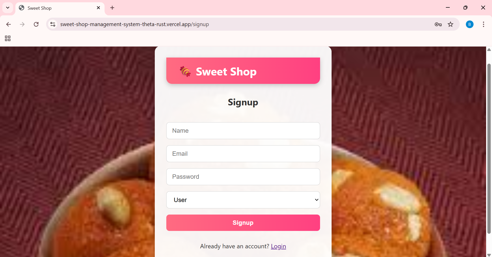
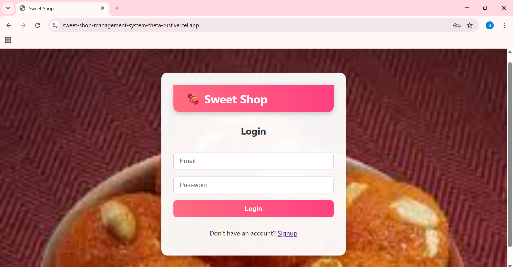
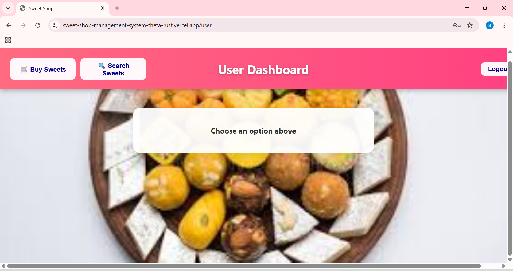
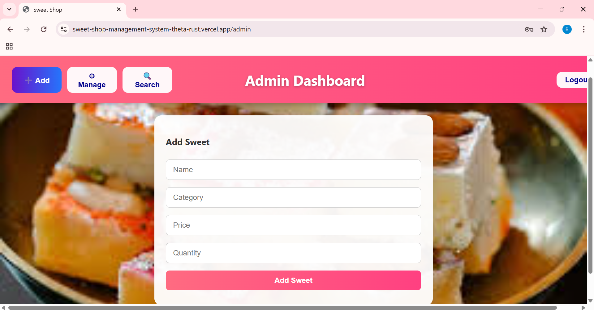
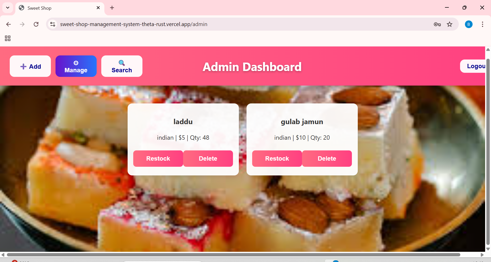
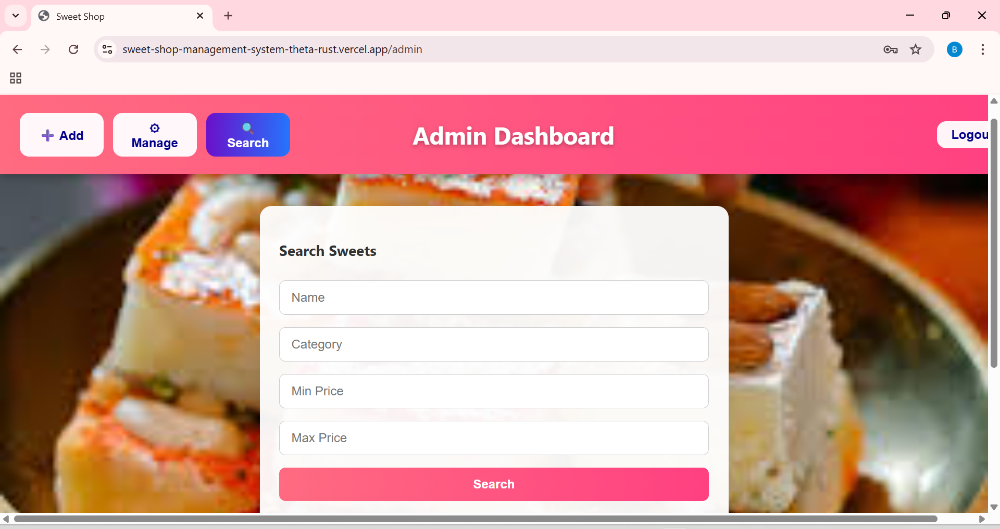
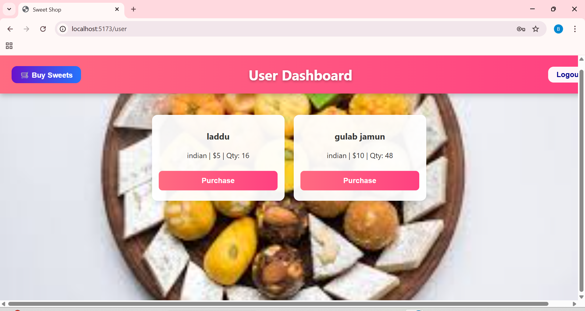
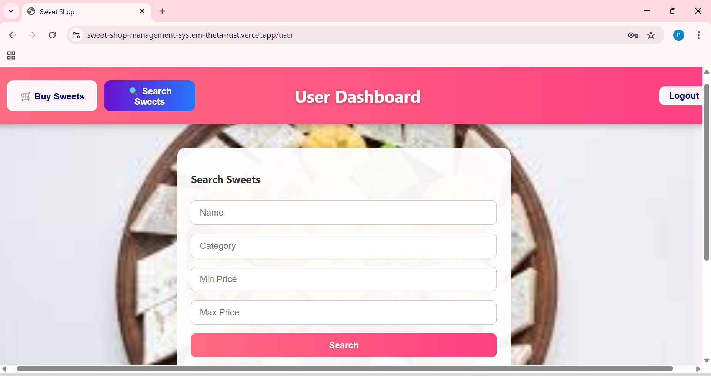

# 🍭 Sweet Shop Management System 🍬
A modern **Full-Stack Sweet Shop Management System** built with **React**, **Node.js**, **Express**, and **MongoDB**.  
Designed with **Test-Driven Development (TDD)** principles and clean, responsive UI.

---

## 🌟 Project Overview

The **Sweet Shop Management System** is a web app that allows users to **browse, purchase, and manage sweets** while providing admins with full inventory control.

**Roles & Permissions:**

| Role | Capabilities |
|------|--------------|
| 🧑‍💻 User | Browse sweets, place orders, view purchase history |
| 🧑‍🔧 Admin | Add, update, restock, and delete sweets |

---

## 🎯 Key Features

- 🔐 **JWT Authentication** for secure login & registration  
- 👤 **Role-Based Authorization** (Admin / User)  
- 📦 **Inventory Management** for admins  
- 🛒 **Smooth Purchase Flow** for users  
- 💻 **Responsive Design** (mobile & desktop friendly)  
- ✅ **Test-Driven Development** for reliability  
- ⚡ **Fast & Modern Stack** (React + Vite + Node + Express + MongoDB)  

---

## 🚀 Live Demo

- **Frontend (React)**: [Visit Here](https://sweet-shop-management-system-theta-rust.vercel.app)  
- **Backend (API)**: [Check API](https://sweet-shop-management-system-5c0g.onrender.com/api)  

---

## 🛠️ Tech Stack

| Frontend | Backend | Database |
|----------|---------|---------|
| React + Vite | Node.js + Express | MongoDB Atlas |
| React Router DOM | JWT Authentication | Mongoose ODM |
| Axios | Role-based Authorization | |

---

## 💡 Getting Started

### Clone the repo

```bash
git clone https://github.com/BonagiriSahithya/Sweet-Shop-Management-System.git
````

### Backend

```bash
cd backend
npm install
npm run dev
```

### Frontend

```bash
cd frontend
npm install
npm run dev
```

> Make sure your `.env` variables are set properly:
>
> ```
> PORT=5000
> MONGO_URI=<your-mongodb-uri>
> JWT_SECRET=<your-secret-key>
> VITE_API_URL=https://sweet-shop-management-system-5c0g.onrender.com/api
> ```

---


## 🖼️ Screenshots & UI Preview

### 🔐 Signup


### 🔑 Login


### 🛠️ Admin Dashboard


### 👤 User Dashboard


### ➕ Add Sweets (Admin)


### 📦 Manage Sweets (Admin)


### 🔍 Search Sweets


### 🛒 Purchase Sweets


### 🔎 User Search Sweets


---

## 🔗 Useful Links

* GitHub Repo: [Sweet Shop Management System](https://github.com/BonagiriSahithya/Sweet-Shop-Management-System)
* Live Frontend: [Vercel](https://sweet-shop-management-system-theta-rust.vercel.app/signup)
* Live Backend API: [Render](https://sweet-shop-management-system-5c0g.onrender.com/api)

---

## 💖 Contributing

Feel free to open issues or submit pull requests. Contributions are welcome!

---

